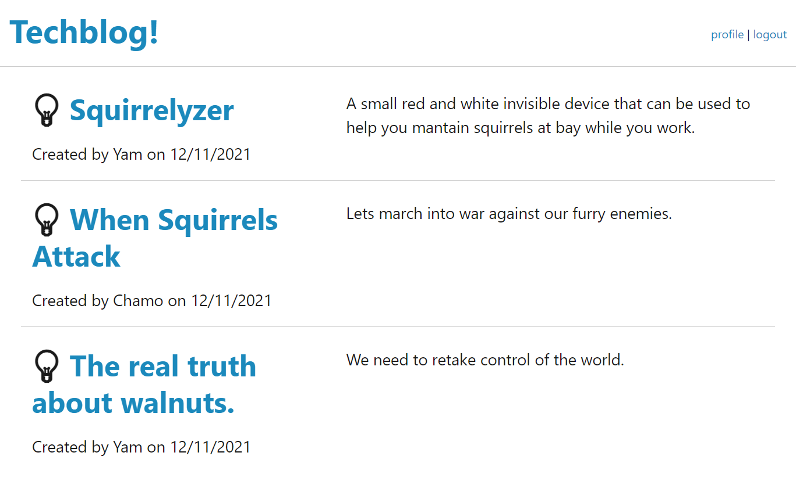

# TechBlog
[Link Here](https://yamcham0.github.io/TechBlog/)
## Description

Able to login and post new content into the database.

## Table of Contents (Optional)

- [Installation](#installation)
- [Usage](#usage)
- [Credits](#credits)
- [License](#license)

## Screenshot

## Usage
Create a new post and input the requested information.

# Credits
## Github

chuck2076

damienluzzo33

## License

 MIT

## Badges

 
