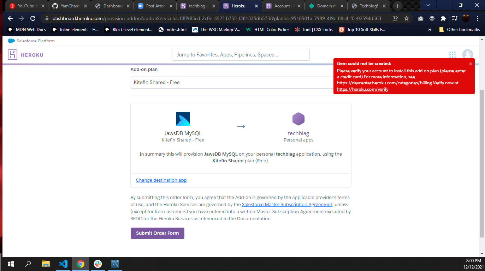
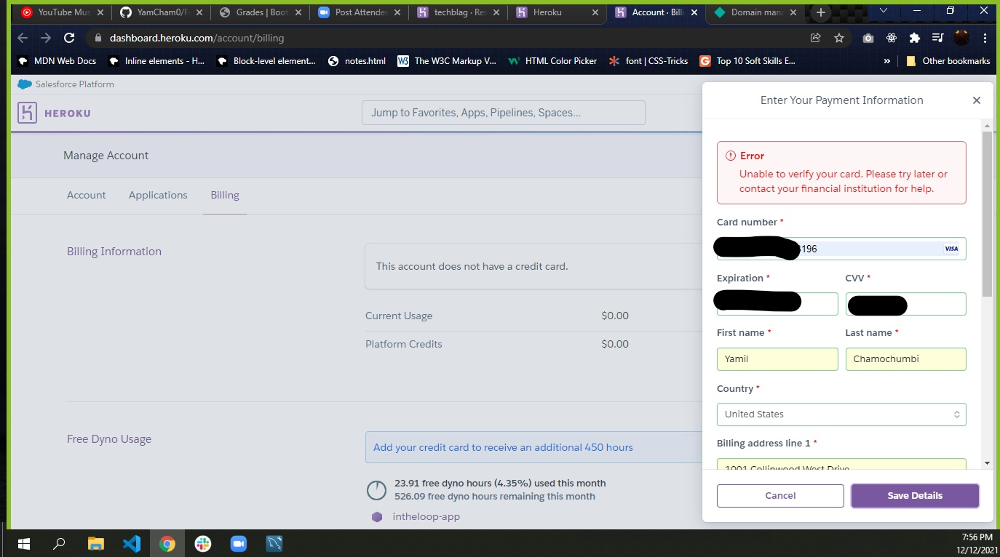

# TechBlog
[Link for Video](https://drive.google.com/file/d/1O-ygPnxwz-t6NX_1oXNmMyCIvEWUBrFZ/view)
[Link for Repo](https://github.com/YamCham0/TechBlog)
## Description

I was having problem with heroku asking me for my credit card and heroku wasn't able to verify my account.
Able to login and post new content into the database.

## Table of Contents (Optional)

- [Installation](#installation)
- [Usage](#usage)
- [Credits](#credits)
- [License](#license)

## Screenshot

## Usage
Create a new post and input the requested information.

# Credits
## Github

damienluzzo33

## License

 MIT

## Badges

 
